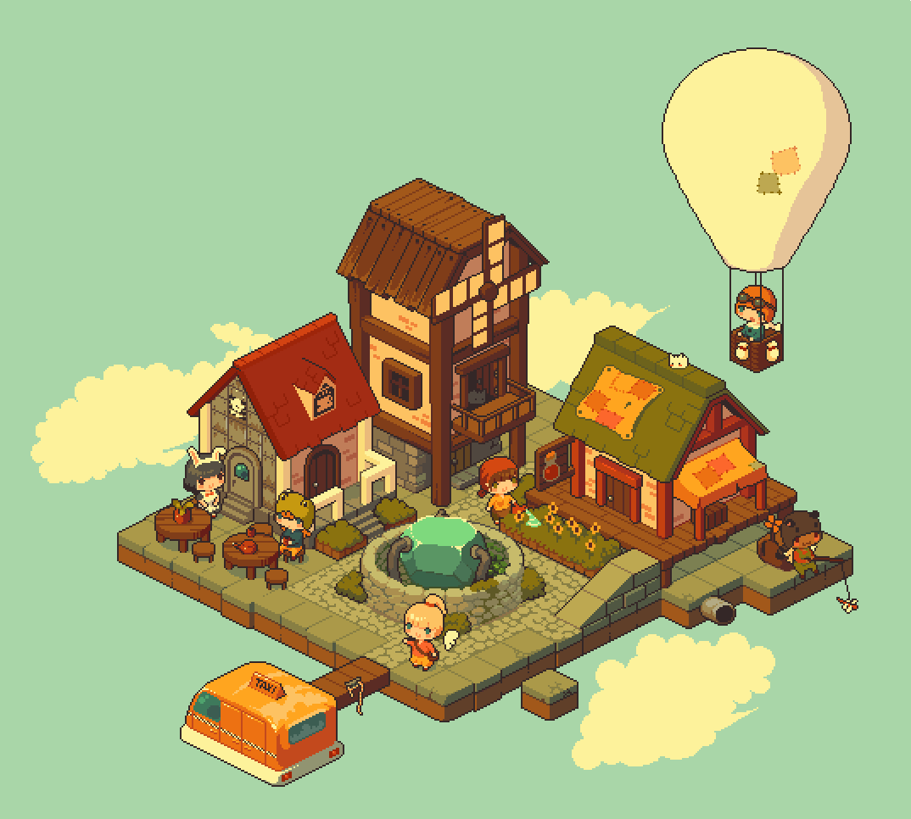
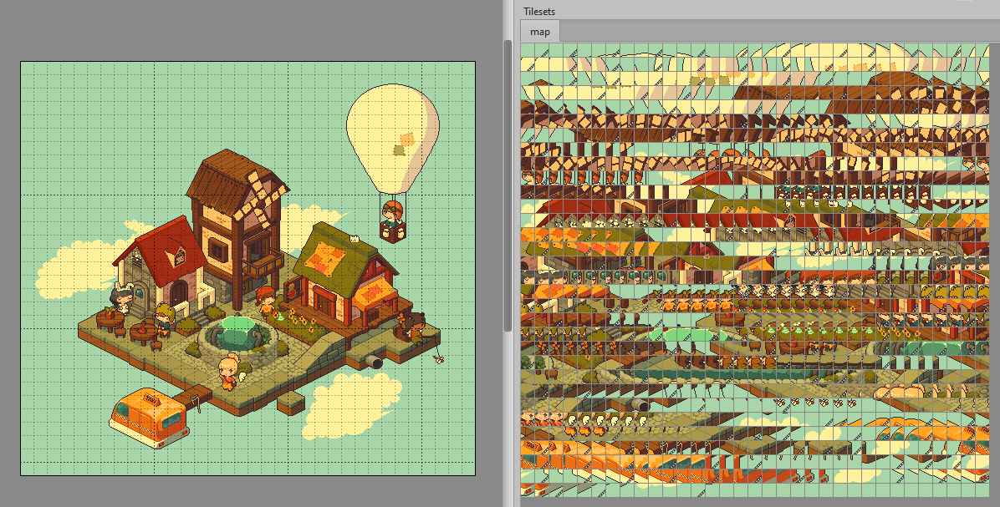
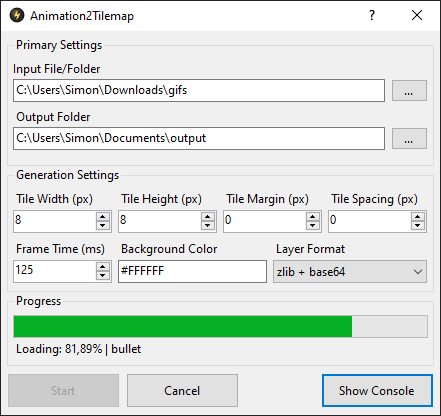

# Animation2Tilemap: Convert Animations to Tilemaps

Animation2Tilemap is a tool to easily convert images to tilemaps and tilesets.

Animation2Tilemap is a tool I created to streamline the process of transforming animations into tilesets and tilemaps.
It is the result of my personal experiences and challenges in the creation of isometric game assets. The tool provides
both a command-line interface and an easy-to-use GUI option for converting animations into
either [tilemaps](https://doc.mapeditor.org/en/stable/reference/tmx-map-format/) or tilesets.

The files generated by Animation2Tilemap can be effortlessly imported into [Tiled](https://www.mapeditor.org/), for
further editing and customization. This seamless integration makes the process of converting image to tilemap a lot more
efficient.

## Example

Let's illustrate the capabilities with the following input image. This image contains both static and dynamic elements.

|        Input Image        |      Resulting Output       |
|:-------------------------:|:---------------------------:|
|  |  |

By utilizing this tool, you can convert the input animation, featuring a mix of static and dynamic elements, into an
animated tileset and tilemap. It results in a set of PNG, TSX, and TMX files that collectively represent the original
image or animation.

Image source: https://x.com/jmw327/status/1405872936783802384

## Features

Animation2Tilemap offers the following features:

- Supports various input formats, including Bmp, Gif, Jpeg, Pbm, Png, Tiff, Tga, and WebP.
- Allows you to process animations to tilemaps from either folders or images that contain multiple frames.
- Allows you to generate an animated tileset from an image or a folder containing extracted animation frames.
- Allows you to customize the tile size, transparent color, and frame duration of your animations.
- Generates tilesets and tilemaps in Tiled compatible formats, such as base64, zlib, gzip, and csv.

## Screenshots

## Installation

Before installing Animation2Tilemap, make sure you have the .NET 8 runtime installed on your system. You can get it
from https://dotnet.microsoft.com/en-us/download/dotnet/8.0

To install Animation2Tilemap, you need to follow these steps:

- Go to the [releases page](https://github.com/vonhoff/Animation2Tilemap/releases) and download the latest version.
- Extract the zip file to a folder of your choice. You can use any file manager or unzip utility to do this.

To see the help page within the command-line application, you can run Animation2Tilemap with the `--help` option. This
will show you the available options and parameters that you can use with Animation2Tilemap.

## Command-line Usage

Open a terminal and go to the folder where you installed Animation2Tilemap. To convert an animation into a tileset and
tilemap, run this command: `animation2tilemap.console -i <input> -o <output>` where `<input>` and `<output>` are the
paths to
the animation and output folders respectively.

You can also specify other options to customize the output, such as:

| Option                                    | Description                                           | Default    |
|-------------------------------------------|-------------------------------------------------------|------------|
| `-d` `--duration <duration>`              | The duration of each animation frame in milliseconds. | `125`      |
| `-h` `--height <height>`                  | The height of each tile in pixels.                    | `8`        |
| `-w` `--width <width>`                    | The width of each tile in pixels.                     | `8`        |
| `-m` `--margin <margin>`                  | The margin around the tiles.                          | `0`        |
| `-s` `--spacing <spacing>`                | The spacing between the tiles.                        | `0`        |
| `-t` `--transparent <transparent>`        | The transparent color in RGBA format.                 | `00000000` |
| `-f` `--format <base64\|zlib\|gzip\|csv>` | The format of the tile layer data.                    | `zlib`     |
| `-v` `--verbose`                          | Enables verbose logging for debugging purposes.       | `false`    |
| `-?` `--help`                             | Shows help and usage information.                     |            |

For example, this command converts the `anim` folder into a tileset and a tilemap with 16x16 pixels tiles, magenta
transparent color, using gzip compression and 200ms frame duration:

`animation2tilemap.console -i anim -o output -h 16 -w 16 -t FF00FF -f gzip -d 200`

## Motivation

I was inspired by classic isometric games like [Populous](https://en.wikipedia.org/wiki/Populous_(video_game)). I wanted
to recreate its immersive atmosphere in my own projects using [Tilengine](https://megamarc.itch.io/tilengine) as a
rendering engine. However, I faced a challenge with its lack of native support for diamond isometric tiles.

To overcome this, I devised a workaround: dividing pre-rendered animated images into square tiles. This approach allowed
me to integrate animated elements into an orthographic tileset. However, the process was cumbersome, involving manual
extraction, slicing, filtering duplicates, and organizing the tiles.

Tilengine doesn't support diamond tiles because standard 2D chipsets
don't support them either. Classic isometric games running on consoles, such as Populous, used standard square tiles
that were diagonally split, which combined the corners of different diamond tiles. So they gave the illusion of
isometric tiles.

Determined to simplify this process, I developed Animation2Tilemap. This tool automates the conversion from animated
images to tilemaps. It's versatile, supporting various types of animations, including GIFs. However, due to practical
considerations, it's particularly ideal for small and simple animations.

## How It Works

### Tileset Generation

The tileset generation algorithm starts by iterating over each frame in the given list of frames. For each frame, it
calculates the positions of the tiles and extracts each tile from the frame.

After extraction, this algorithm computes a hash for each tile. This hash serves as an identifier, allowing the
algorithm to recognize similar tiles across different frames. For each unique hash, it generates a new tile and appends
it to the list of registered tiles.

To create animated tiles, the algorithm traverses the tile images associated with each position. If a tile image is
different from the previous one, it appends an animation frame for the previous tile image. If a tile image is identical
to the previous one, it simply increments the duration of that frame.

### Tilemap Generation

The tilemap generation algorithm begins by mapping the hash of each tile animation to its corresponding tile ID. This
mapping is used to create an array that embodies the map data. Each element in this array corresponds to a tile position
in the tilemap, and its value represents the ID of the tile to be positioned at that position.

### Tileset Image Generation

This algorithm starts by determining the number of tiles and calculates the layout for the output image. It aims to
create a roughly square layout by taking the square root of the number of tiles to determine the number of columns, and
then dividing the number of tiles by the number of columns to get the number of rows.

Next, it calculates the dimensions of the output image based on the number of rows and columns, the size of the tiles,
the spacing between the tiles, and the border around the tiles. It then creates a new image with these dimensions and
sets the background color to a specified transparent color.

It then iterates over the list of tiles. For each tile, it draws the tile's image onto the output image at the current
position. The position is updated after each tile, moving to the next column until it reaches the edge of the image, at
which point it moves to the next row.

## Acknowledgments

⭐ If you find Animation2Tilemap useful in your projects, consider leaving a star! ⭐

## Contribution

If you want to contribute to Animation2Tilemap, you are welcome to submit pull requests or report issues on GitHub.
