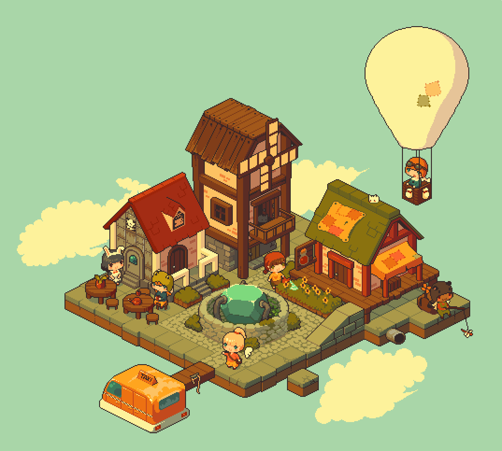
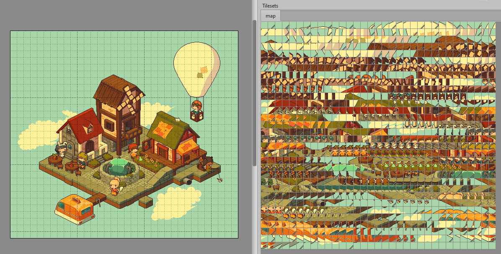

# Animation2Tilemap


[](https://github.com/vonhoff/Animation2Tilemap/releases)
[](LICENSE)

Animation to Tilemap is a tool that converts images or GIF animations into tilemaps and tilesets, compatible with [Tiled](https://www.mapeditor.org/) and other tile-based game development tools.

## Features

- **Versatile Input**: Process PNG, BMP, GIF, JPEG, PBM, TIFF, TGA, and WebP formats.
- **Flexible Animation Handling**: Convert animations from folders or multi-frame images.
- **Animated Tileset Generation**: Create animated tilesets from single images or frame folders.
- **Customization Options**: Adjust tile size, transparency color, and frame duration.
- **Tiled Compatibility**: Generate tilesets and tilemaps in various formats (Base64, CSV, zlib, gzip).

## Example

Convert a GIF animation into a tileset and tilemap:

|      Input GIF Animation      |         Output Tilemap          |
|:-----------------------------:|:-------------------------------:|
|  |  |

Image source: https://x.com/jmw327/status/1405872936783802384

## Installation

1. Ensure you have [.NET 8 runtime](https://dotnet.microsoft.com/en-us/download/dotnet/8.0) installed.
2. Download the latest release from the [releases page](https://github.com/vonhoff/Animation2Tilemap/releases).
3. Extract the zip file to your preferred location.

## Usage

Basic usage:

```
animation2tilemap -i <input file/folder> -o <output folder>
```

For a full list of options, use:

```
animation2tilemap --help
```

## Motivation

Animation to Tilemap was created to make it easier to convert animations into tilesets and tilemaps. I found the process of manually slicing frames, creating animations, and manually removing duplicate tiles to be both time consuming and error prone.

## Algorithm Details

The conversion process begins by loading the input images, which can be standard image files, multi-frame GIFs, or sequences from a directory. Multi-frame formats such as GIFs are automatically grouped into animations.

For directories of images with matching dimensions, the tool checks if they could form an animation. If so, it prompts the user for confirmation, unless the `--assume-animation` flag is set to skip the prompt. If confirmed (or if the flag is set), the images are grouped into one animation with a base name inferred from the filename patterns. Otherwise, each image is processed individually.

The grouped frames are aligned: the tool calculates the maximum width and height of all the frames, rounds them to the nearest multiple of the tile size, and centers each frame on a new canvas with transparent padding to ensure uniform dimensions.

The aligned frames are then divided into tiles. The tool tracks tile sequences at each position across frames and uses image hashing to detect unique tiles, ensuring that duplicates are stored only once in the tileset.

Tile animations are defined by listing, for each grid position, the sequence of unique tile IDs and their display durations. Identical consecutive tiles are merged into a single frame with a combined duration.

Finally, the tool generates a tilemap that references the tileset and reconstructs the original animation. It creates a map layer where each tile corresponds to a frame in the animation, using the tile IDs to place them in order.

## Support

If you find Animation2Tilemap useful:

- ⭐ Star the [project on GitHub](https://github.com/vonhoff/Animation2Tilemap)
- 💖 Consider [becoming a sponsor](https://github.com/sponsors/vonhoff)

## License

Animation2Tilemap is open-source software licensed under the [MIT License](LICENSE).
