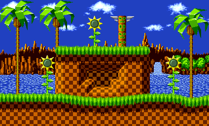

# Animation2Tilemap


[](https://github.com/vonhoff/Animation2Tilemap/releases)
[](LICENSE)

Animation2Tilemap is a tool that converts images or GIF animations into tilemaps and tilesets, compatible with [Tiled](https://www.mapeditor.org/) and other tile-based game development tools.

## Features

- **Wide Format Support** - Process PNG, BMP, GIF, JPEG, PBM, TIFF, TGA, and WebP images
- **Animation Detection** - Automatically convert animations from folders or multi-frame images
- **Tileset Generation** - Create optimized animated tilesets with duplicate tile detection
- **Tilemap Generation** - Generate complete tilemaps that recreate your original animations
- **Advanced Customization** - Control tile size, transparency settings, and frame timing

## Limitations

- Only orthographic maps are supported at this time

## Example

Convert a GIF animation into a tileset and tilemap:

|                          From                          |                           To                            |
|:------------------------------------------------------:|:-------------------------------------------------------:|
|     |  |

## Getting Started

### Installation

1. Ensure you have [.NET 10 runtime](https://dotnet.microsoft.com/en-us/download/dotnet/10.0) installed.
2. Download the latest release from the [releases page](https://github.com/vonhoff/Animation2Tilemap/releases).
3. Extract the zip file to your preferred location.

### Usage

```
animation2tilemap -i <input file/folder> -o <output folder>
```

For a full list of options, use:

```
animation2tilemap --help
```

## How It Works

It starts by loading the input, which can be a single image, a multi-frame file (such as a GIF), or a folder of images. Multi-frame files are automatically treated as animations. When processing a folder where all images have the same dimensions, they are assumed to be animation frames; confirmation is requested unless the `--assume-animation` option is used.

Next, the tileset factory divides each frame into tiles and uses image hashing to track unique tiles at each grid position, ensuring that only unique tiles are stored for a compact tileset. For each grid position, a unique identifier is generated to represent the sequence of tiles across frames, capturing any tile animation patterns.

Finally, the tilemap factory constructs a tilemap that references the generated tileset, creating a map layer that reflects the original frame layout. It then uses the calculated sequence IDs to assign the correct animated tile ID to each grid position, reconstructing the original animation.

## Related Projects

For converting tilemaps to GIFs, check out [Tilemap2Animation](https://github.com/vonhoff/Tilemap2Animation).

## Support and Contribute

If you find value in this project, there are several ways you can contribute:

- Give the [project](https://github.com/vonhoff/Animation2Tilemap) a star on GitHub.
- Support the project through [GitHub Sponsors](https://github.com/sponsors/vonhoff).
- Improve documentation, report bugs, or submit pull requests.

## License

Animation2Tilemap is open-source software licensed under the [MIT License](LICENSE).
