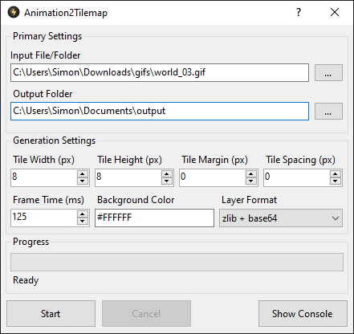

# Animation2Tilemap

Animation2Tilemap is a tool to easily convert images or animated images to tilemaps and tilesets.

The files generated by Animation2Tilemap can be imported into [Tiled](https://www.mapeditor.org/) for further editing
and customization. This tool provides both a command-line interface and an easy-to-use GUI option.

## Features

Animation2Tilemap offers the following features:

- Support for various input formats, including Bmp, Gif, Jpeg, Pbm, Png, Tiff, Tga, and WebP.
- Process animations to tilemaps from either folders or images that contain multiple frames.
- Generate an animated tileset from an image or a folder containing extracted animation frames.
- Customize the tile size, transparent color, and frame duration of your animations.
- Generate tilesets and tilemaps in Tiled compatible formats, such as base64, zlib, gzip, and csv.

## Example Use Case

Using this tool, you can convert the following animation into an animated tileset and tilemap. It results in a set
of PNG, TSX, and TMX files that collectively represent the original image.

|        Input Image        |      Resulting Output       |
|:-------------------------:|:---------------------------:|
|  |  |

Image source: https://x.com/jmw327/status/1405872936783802384

## Installation

Before installing Animation2Tilemap, make sure you have the .NET 8 runtime installed on your system. You can get it
from https://dotnet.microsoft.com/en-us/download/dotnet/8.0

To install Animation2Tilemap, you need to follow these steps:

- Go to the [releases page](https://github.com/vonhoff/Animation2Tilemap/releases) and download the latest version.
- Extract the zip file to a folder of your choice. You can use any file manager or unzip utility to do this.

## Command-line Usage

Open a terminal and go to the folder where you installed Animation2Tilemap. To convert an animation into a tileset and
tilemap, run this command: `animation2tilemap.console -i <input> -o <output>` where `<input>` and `<output>` are the
paths to the animation and output folders.

To see the help page within the command-line application, you can run the console application with the `--help` option.
This will show you the available options and parameters that you can use.

You can also specify other options to customize the output, such as:

| Option                                    | Description                                           | Default    |
|-------------------------------------------|-------------------------------------------------------|------------|
| `-d` `--duration <duration>`              | The duration of each animation frame in milliseconds. | `125`      |
| `-h` `--height <height>`                  | The height of each tile in pixels.                    | `8`        |
| `-w` `--width <width>`                    | The width of each tile in pixels.                     | `8`        |
| `-m` `--margin <margin>`                  | The margin around the tiles.                          | `0`        |
| `-s` `--spacing <spacing>`                | The spacing between the tiles.                        | `0`        |
| `-t` `--transparent <transparent>`        | The transparent color in RGBA format.                 | `00000000` |
| `-f` `--format <base64\|zlib\|gzip\|csv>` | The format of the tile layer data.                    | `zlib`     |
| `-v` `--verbose`                          | Enables verbose logging for debugging purposes.       | `false`    |
| `-?` `--help`                             | Shows help and usage information.                     |            |

## Screenshot

## Motivation

I was inspired to create Animation2Tilemap by my love for classic isometric games like Populous. I wanted to capture this unique style in my own game projects, but I found that working with animated isometric tiles was quite challenging.

These games often used square tiles that were split diagonally to create the look of diamond-shaped tiles. This method was necessary due to the limitations of older hardware, and it is still useful today.

The process of converting animated images into tilesets was tedious and time-consuming. It involved manually cutting out frames, organizing tiles, and filtering out duplicates, which could lead to errors. I developed Animation2Tilemap to simplify this workflow.

I also noticed that many developers have trouble converting animated sprites into formats compatible with modern game engines and level editors. This tool automates this process, making it faster and easier to create animated tilesets and tilemaps. It not only saves time, but also allows for more creativity in the design of tile-based games, whether they are isometric or orthographic.

## Acknowledgments

If you find Animation2Tilemap useful in your projects, consider leaving a star! ⭐
